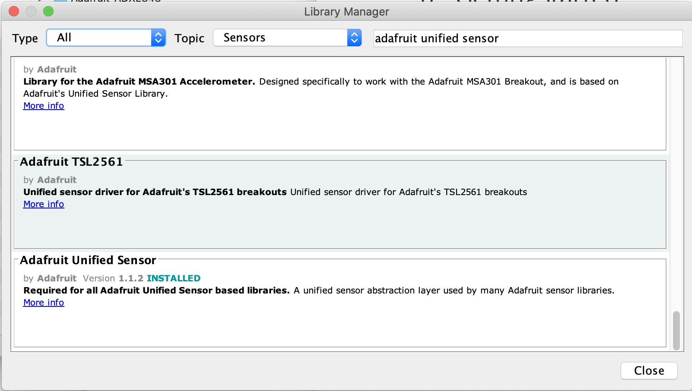

# Arduino code

This repository contains small Arduino code to bet used for measuring sensors. It was originally developed for the SMAART Bootcamp held Feb 21-23 2020.

0. GettingStarted
1. TemperatureLogger
2. OVO7670 Camera

## Installing

For most work with sensors, you need to install `Adafruit` library.

