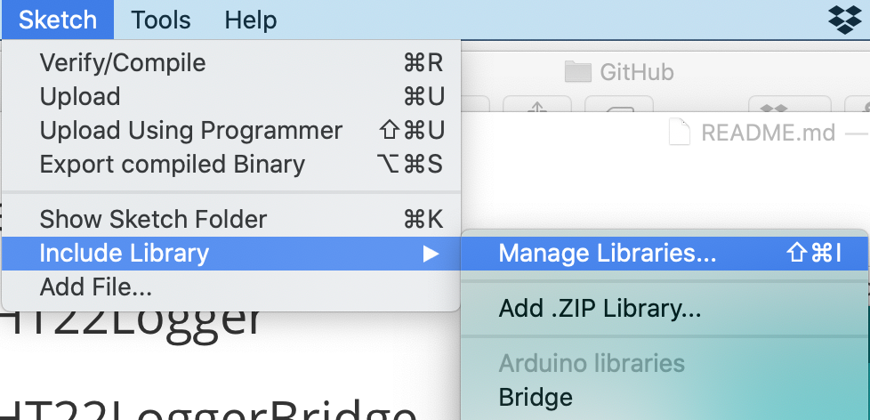
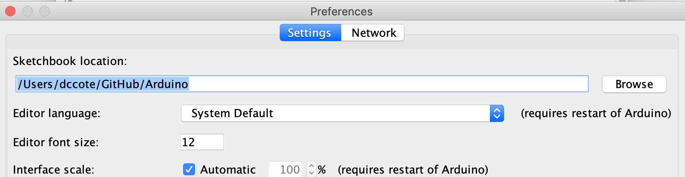

# Arduino code

This repository contains small Arduino code to bet used for measuring sensors. It was originally developed for the SMAART Bootcamp held Feb 21-23 2020.

1. GettingStarted - Trivial example to confirm that everything functions
2. DHT22Logger - Digital temperature and humidity sensor
3. DHT22LoggerBridge - A bridge to read data from the data logger
4. OVO7670Camera - An example using the OVO7670 camera, does not work well
5. [Otto](https://www.ottodiy.com) - If you have an Otto robot with motors and a range finder, the many examples in this folder are for the robot, but they are also simple examples that can be used to understand.

## Installing required libraries

For most work with sensors, you need to install `Adafruit` library.  In the Arduino IDE, you go to Manage Libraries:

then choose the library **Adafruit Unified Sensors** which you can install:

You may need other libraries which you may find in the Library Manager, or in the Arduino Libraries folder for the [bootcamp](https://drive.google.com/open?id=18GHKEBaW2cN3h2tDedXozpFqsq8FvtFG).

If you download libraries, they can also simply be copied into your `Arduino/libraries` folder, which is set in your Preferences:

